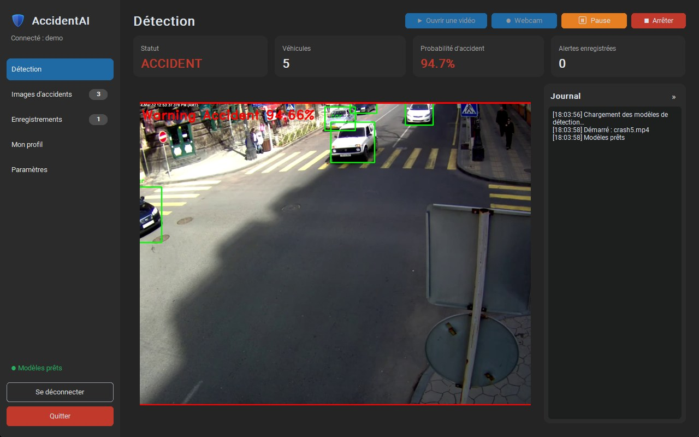
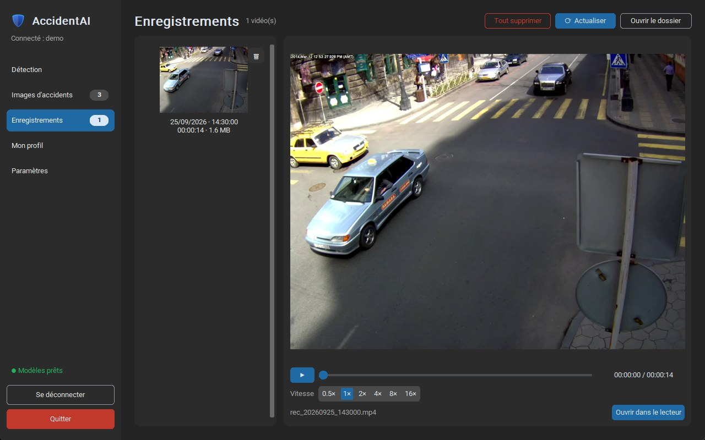
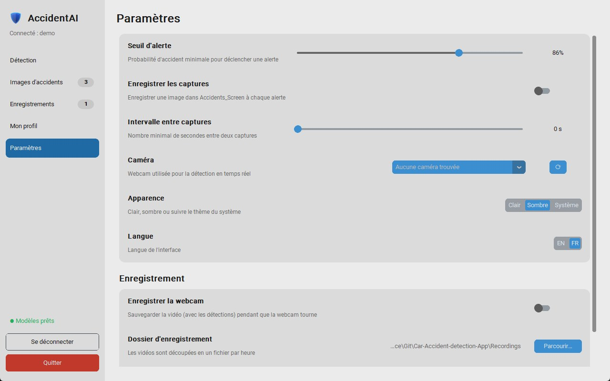

# AccidentAI : Car Accident Detection

Windows desktop application that detects road accidents in real time on a video file or a webcam. It finds the vehicles with **YOLOv3**, estimates the probability of an accident with a **CNN**, raises an alert, saves snapshots and recordings, and backs everything up to **MongoDB Atlas** through a small FastAPI server.



| Recordings | Settings (light theme) |
|---|---|
|  |  |

**Website:** https://achraf-badri.github.io/Car-Accident-detection-App/ (download page, served from `docs/`)

## Features

- **Detection** on a video file (MP4, AVI, MKV, WEBM, MOV) or a webcam, played in real time, with pause / resume / stop
- **Alerts** above an adjustable threshold (86% by default), with an event log (can be folded to give the video more room) and a snapshot of every alert
- **Webcam recording** split into one-hour files, with an optional duration limit, and a built-in player (0.5× to 16×)
- **Accounts**: sign up, sign in (with "remember my username"), profile (name, email) and password change
- **Cloud backup**: accident images and finished recordings are uploaded in the background and retried if the connection drops
- **Accident images** and **recordings** pages, with their count shown in the menu; delete one by one or all at once, on this PC and in the cloud
- **Admin area**: dashboard (users, images, videos, storage, uploads per day), create / suspend / delete users, change roles, edit profiles, view and delete every user's images and videos
- **Modern interface** (CustomTkinter): light / dark / system theme, English / French, loading screen at startup

## Architecture

```
Desktop app (CustomTkinter)  ──HTTP + JWT──>  API server (FastAPI, server/)  ──>  MongoDB Atlas
  YOLOv3 (OpenCV DNN)                           accounts, roles                     users
  accident CNN (TensorFlow / Keras)             media upload / download             GridFS: images, videos
```

The desktop app never talks to the database directly: only the API server holds the MongoDB credentials. When `API_URL` points to the local machine, the app starts the server by itself.

```
main.py                     entry point (desktop app)
desktop/                    the Windows app
├── app.py                  main window and pages
├── splash.py, i18n.py      loading screen, EN / FR texts
├── paths.py                where resources are read and user data is written
├── ui/                     widgets, admin area, profile page
├── detection/              detector.py (YOLOv3 + classifier), classifier.py, recorder.py
└── cloud/                  api_client.py, uploader.py
server/                     API (FastAPI): auth, media (GridFS), admin, download emails — deployed on Render
training/                   train_model.py, download_training_data.py, overlays.py, training_cnn.ipynb
assets/                     images/ (logo, icon), yolo/ (YOLOv3), model/ (accident classifier)
data/                       training images: train / val / test, Accident / Non Accident
samples/                    test videos and example snapshots
docs/                       website (GitHub Pages)
```

User data is kept outside the project, in `%APPDATA%\AccidentAI\`: `settings.json`, `Accidents_Screen/<username>/`, `Recordings/<username>/` and the pending uploads. Data from older versions (in the project folder) is moved there automatically on first launch.

## Installation

Requires **Windows 10 / 11** and **Python 3.11** (tested with TensorFlow / Keras 2.15).

1. **Clone the project and install the dependencies**

    ```bash
    git clone https://github.com/ACHRAF-BADRI/Car-Accident-detection-App.git
    cd Car-Accident-detection-App
    pip install -r requirements.txt
    ```

2. **Add the two model files**, which are too large for the repository (GitHub limit: 100 MB):
    - `assets/yolo/yolov3.weights` — download it from https://huggingface.co/spaces/Epitech/Scarecrow/blob/main/yolov3.weights
    - `assets/model/model_weights.h5` — the accident classifier, produced by `training/training_cnn.ipynb` (or retrained with `training/train_model.py`, see below)

3. **Create a `.env` file** at the project root (it is git-ignored, never commit it):

    ```
    MONGODB_URI=mongodb+srv://<user>:<password>@<cluster>/?retryWrites=true&w=majority
    MONGODB_DB=accident_detection
    JWT_SECRET_KEY=<long random string>
    JWT_EXPIRE_HOURS=12
    ADMIN_USERNAME=<first admin>
    ADMIN_PASSWORD=<their password>
    API_URL=http://127.0.0.1:8000
    # optional: email on each download from the website (Resend)
    RESEND_API_KEY=<re_... key, "sending access" only>
    RESEND_FROM=AccidentAI <onboarding@resend.dev>
    NOTIFY_EMAIL=<where to receive the emails>
    NOTIFY_TIMEZONE=UTC
    ```

    The admin account is created the first time the server starts. Everyone else signs up from the login screen (role "user"); an admin can promote them.

4. **Run the application**

    ```bash
    python main.py
    ```

    To run the API server on its own (for example on another machine), use `python -m uvicorn server.main:app --host 127.0.0.1 --port 8000` and point `API_URL` to it.

## Usage

1. **Sign in** or create an account.
2. **Detection**: click *Open video* or *Webcam*. Vehicles are boxed, the probability and the status update live, and alerts are written to the event log. *Pause* / *Resume* works on video files; *Stop* asks for confirmation and clears the screen. With no webcam plugged in, the app opens the camera setting.
3. **Accident images** and **Recordings**: browse, play (with speed control), open the folder, or delete one / all.
4. **Settings**: alert threshold, snapshots and snapshot interval, camera, theme, language, and webcam recording (folder, duration or no limit).
5. **My profile**: full name, email, password.
6. **Administration** (admins only): dashboard and user management.

Local files are stored per account in `%APPDATA%\AccidentAI\`: `Accidents_Screen/<username>/` and `Recordings/<username>/` (the recordings folder can be changed in Settings).

## Improving the model

The classifier looks at the whole frame resized to 250×250. `assets/model/model.json` + `assets/model/model_weights.h5` is the original CNN (`training/training_cnn.ipynb`).

- **`training/download_training_data.py`** adds CCTV images to `data/`: accident frames (CC0 dataset on Hugging Face) and normal traffic from road cameras (UA-DETRAC). Sources and licenses are listed in [data/SOURCES.md](data/SOURCES.md); the downloaded files are not committed.
- **`training/train_model.py`** trains an EfficientNetB0 classifier (transfer learning, augmentation, random text / logo overlays so captions are not mistaken for accidents), compares it with the existing models on `data/test`, and installs it as `assets/model/accident_model.keras` **only if it scores better**. Results go to `assets/model/training_report.json`.

```bash
python training/download_training_data.py
python training/train_model.py              # train, compare, install if better
python training/train_model.py --no-install # train and compare only
```

The app loads `assets/model/accident_model.keras` first when it exists; delete it to go back to the original model.

Test videos are in `samples/videos/` (credits in [samples/videos/SOURCES.md](samples/videos/SOURCES.md)).

## Deploying

| Part | Where |
|---|---|
| API server (`server/`) | **Render**, from `render.yaml` |
| Database | **MongoDB Atlas** |
| Download page (`docs/`) | **GitHub Pages** |
| Installer (`.exe`) | **GitHub Releases** (up to 2 GB per file) |

### API server on Render

1. On Render: **New → Blueprint**, pick this repository. Render reads `render.yaml` (build `pip install -r server/requirements.txt`, start `uvicorn server.main:app`).
2. Fill in the secrets it asks for: `MONGODB_URI`, `JWT_SECRET_KEY`, `ADMIN_USERNAME`, `ADMIN_PASSWORD`, `RESEND_API_KEY`, `NOTIFY_EMAIL`. They stay in the Render dashboard, never in the repository.
3. In MongoDB Atlas → **Network Access**, allow Render to connect.
4. Check `https://<your-service>.onrender.com/health` returns `{"status":"ok"}`, then set that address as `API_URL` in the desktop app and in `docs/script.js`.

The free Render plan sleeps after 15 minutes without requests; the next request then takes 30-60 s.

### Website and download emails

`docs/` is a static site (HTML / CSS / JS, EN / FR) for **GitHub Pages**: *Settings → Pages → Deploy from a branch → `main` / `docs`*. Its download button reads the latest **GitHub Release** and links to the attached `.exe`; until a release exists it points to the releases page.

When `API_URL` is set in `docs/script.js`, each click on the download button is reported to `POST /track/download`: the server counts it (collection `downloads`, no IP address stored) and emails `NOTIFY_EMAIL` through **Resend**, at most once per visitor every 10 minutes and 20 emails per hour. The download itself goes straight to GitHub and is never delayed.

Without a verified domain in Resend, emails are sent from `onboarding@resend.dev` and can only go to the address of the Resend account.

## Security notes

- `.env` holds the database password, the JWT secret and the Resend key: keep it out of git and out of any installer.
- Before distributing an installer, host the API server online and ship the app with only `API_URL` pointing to it; the desktop app must not contain the MongoDB credentials.
- The free Atlas tier (M0) holds 512 MB, which a few hours of video can fill; the admin dashboard turns the storage figure red above 80%.

## Built with

Python · OpenCV · TensorFlow / Keras · CustomTkinter · FastAPI · MongoDB Atlas (PyMongo, GridFS) · PyJWT · bcrypt
